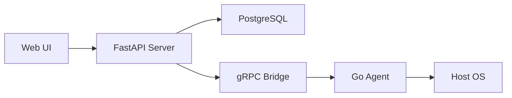

# Architecture

High-level overview of the HL Helper system architecture.

!!! note "Under construction"
    Detailed architecture documentation is being written. Check back soon.

## Components

- **FastAPI Server** -- Python control plane handling REST API, WebSocket UI, and scheduling
- **gRPC Bridge** -- bidirectional streaming connection between server and agents
- **Go Agent** -- lightweight binary running on each managed host
- **PostgreSQL** -- persistent storage for hosts, audit log, and configuration
