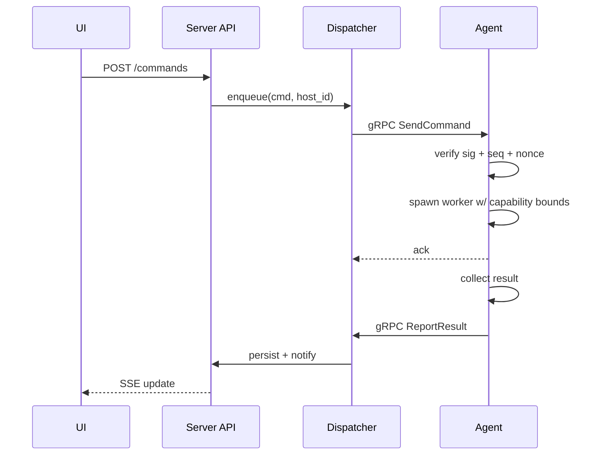

# Agent

The hl_helper agent is a lightweight, single static Go binary deployed to each managed host. It runs as an unprivileged system user, receives signed commands over mTLS gRPC, executes them within a sudoers allowlist, and returns signed results. The agent is **outbound-only and read-only** on server state: it cannot enumerate other hosts, initiate commands, or mutate server records.

---

## Overview

The agent bridges the control plane and the host OS. On each host, the agent:

1. **Maintains secure identity**: Ed25519 signing key + ECDSA TLS cert, both persisted to disk (or TPM-sealed).
2. **Subscribes to commands**: Opens a persistent, bidirectional gRPC stream to the server over mTLS.
3. **Executes signed commands**: Receives `CommandEnvelope`, verifies signature, checks capability manifest, dispatches to a worker goroutine, and collects output.
4. **Signs and returns results**: Assembles a `ResultEnvelope`, signs with its Ed25519 key, and sends back over the same stream.
5. **Reports heartbeats**: Every 30 seconds (configurable), sends a `Heartbeat` with metrics (CPU load, memory, uptime, agent version) and the last acked sequence number.
6. **Manages certificates**: Initiates rotation at 50% TTL; requests capability tokens for special operations; rotates signing keys on server request.
7. **Graceful shutdown**: Drains outbox on SIGTERM, decommissions (wipes keys) on explicit request.

The agent runs as a systemd service on Linux/Unix hosts. Multi-arch builds (amd64, arm64, armv7) are available. No Docker, no Python, no external dependencies; the binary is distroless-friendly and requires only `ca-certificates` for TLS verification.

---

## Static Binary Characteristics

- **Language**: Go 1.23+ (grpc-go, ed25519 stdlib, sqlite3 via cgo).
- **Architecture**: Multi-arch: `linux/amd64`, `linux/arm64`, `linux/arm/v7`.
- **Size**: ~20 MB compressed, ~40 MB uncompressed (distroless base).
- **Dependencies**: None beyond libc, libsqlite3, ca-certificates.
- **Build**: Single `Makefile` target; builds all architectures from one source tree.
- **Distribution**: Signed with cosign; SBOM and Trivy scan included.

---

## State Management: SQLite-Backed

The agent maintains persistent state at `/var/lib/hl-agent/` (owner: `hl-agent:hl-agent`, mode 0700):

### Files and Directories

| Path | Purpose | Mode | Notes |
|---|---|---|---|
| `/var/lib/hl-agent/config.json` | Server URL, CA fingerprint, enroll state | 0600 | Written once at enrollment; immutable after. |
| `/var/lib/hl-agent/signing.key` | Ed25519 private key (or TPM handle) | 0600 | Rotated server-initiated; never exposed in logs. |
| `/var/lib/hl-agent/tls.key` | ECDSA P-256 private key (TLS) | 0600 | Renewed at 50% TTL. |
| `/var/lib/hl-agent/tls.crt` | ECDSA P-256 leaf cert (TLS) | 0600 | Renewed at 50% TTL. |
| `/var/lib/hl-agent/ca.crt` | CA chain (root + intermediate) | 0600 | Updated on cert renewal. |
| `/var/lib/hl-agent/manifest.json` | Signed capability manifest | 0600 | Updated by server; agent verifies signature before trusting. |
| `/var/lib/hl-agent/state.db` | SQLite state store (see below) | 0600 | Persists sequence, nonces, pending commands, outbox. |

### State Store Schema (SQLite)

The `state.db` SQLite database tracks:

- **`sequence`**: Last sequence number acknowledged to the server.
- **`nonces`** (LRU table): Seen nonce dedup for replay protection (in-memory on agent; persisted to SQLite on shutdown for resume).
- **`outbox`**: Queue of commands received but not yet executed or results not yet sent. Used for resume on reconnect.
- **`metrics`**: Recent CPU, memory, uptime samples (for heartbeat payload).

**WAL mode**: Database uses SQLite WAL mode for durability; async writes are batched.

---

## Heartbeat Protocol

The agent sends a `Heartbeat` message every 30 seconds (configurable via server's `HeartbeatConfig`):

```protobuf
message Heartbeat {
  string host_id = 1;
  google.protobuf.Timestamp at = 2;
  uint64 last_acked_seq = 3;
  HostMetrics metrics = 4;
  string agent_version = 5;
  AgentUpdateStatus update_status = 6;
  string update_target_version = 7;
  bool sleeping = 8;
  google.protobuf.Timestamp sleep_until = 9;
  bytes signature = 200;
}
```

**Fields**:
- `last_acked_seq`: Last command sequence the agent executed (used for resume detection).
- `metrics`: Current load, memory, disk usage, network I/O.
- `agent_version`: Semantic version string (e.g., `0.1.0-alpha.1`).
- `update_status`: Enum indicating if agent is idle, downloading, swapping binary, or rolled back.
- `sleeping`: If true, agent is in low-power mode and will not accept new commands until `sleep_until`.

**Server reaction**:
- Acknowledges with `HeartbeatAck` (server timestamp + next expected sequence).
- Updates host's `last_seen_at` and metrics in the audit log.
- If agent version is outdated, may include an `AgentUpdateCmd` in the next ServerToAgent message.

**Missing heartbeat**: If the server does not receive a heartbeat within 3× the interval (default 90 seconds), it marks the host offline. Commands continue to queue; they are executed on the next reconnect.

---

## Command Pipeline: Receive → Verify → Dispatch → Collect → Sign → Return

### 1. Receive (gRPC Stream)

The agent opens a bidirectional gRPC stream `AgentBridge.Stream()` to the server. Both directions are multiplexed on the same connection:

- **Agent → Server**: `Heartbeat`, `ResultEnvelope`, `ResumeRequest`, `CapabilityRequest`, `HostSurvey`, `AgentAuditEvent`.
- **Server → Agent**: `CommandEnvelope`, `HeartbeatAck`, `CertIssueResponse`, `ManifestUpdate`, `Decommission`, `HeartbeatConfig`, `RunSurvey`.

### 2. Verify

When a `CommandEnvelope` arrives, the agent:

1. **Check signature**: Verify the Ed25519 signature against the server's current public key (trust anchor list).
2. **Check sequence**: Ensure `sequence > last_acked_seq` (monotonicity).
3. **Check nonce**: Ensure nonce is not in the recent LRU window (no duplicates).
4. **Check expiry**: Ensure `expires_at > now` (within 5-minute window).
5. **Check clock skew**: Ensure `issued_at <= now + 60s` (NTP tolerance).
6. **Check capability**: Verify the biscuit token (if present) grants the required scope and has not expired.
7. **Check manifest**: Verify the command action is in the capability manifest (e.g., `pkg_update` allowed).

If any check fails, the agent:
- **Does not execute** the command.
- Sends a `ResultEnvelope` with exit code = special failure code (e.g., `-1` for signature fail, `127` for capability denied).
- Logs the rejection to the agent audit log (stored in `state.db`).

### 3. Dispatch

Once verified, the agent dispatches the command to a worker goroutine:

```go
cmd := commandEnvelope.payload  // e.g., PkgUpdate, Reboot, ShellExec
result := dispatch(cmd)  // Executor.Run(cmd)
```

**Worker pool**: A configurable number of worker goroutines (default 4) handle concurrent commands. Commands queue in a channel if all workers are busy.

**Timeout**: Commands must complete within 5 minutes (configurable). If a command times out (e.g., hung upgrade), the agent kills the process, logs a timeout, and returns a failed result.

### 4. Collect (Executor)

The executor handles command-specific logic. For example:

- **`PkgUpdate`**: Invoke the distro-specific package manager (apt, dnf, pacman, etc.) via `sudo`, capture stdout/stderr, return exit code.
- **`Reboot`**: Invoke `sudo /sbin/reboot` (requires manifest approval and optional approval token).
- **`ShellExec`**: Invoke `/bin/bash -c <script>` via `sudo` (high-risk; requires explicit approval gate).
- **`TerminalOpen`**: Spawn a PTY, connect to a WebSocket relay, stream input/output.
- **`DockerOp`**: Discover docker/podman via socket, run compose commands (e.g., pull, restart, scale).
- **`GetFacts`**: Collect host info (OS, kernel, CPU, memory, network), return as `HostSurvey`.
- **`PluginInvoke`**: Load and execute a signed plugin OCI artifact (C6 feature; deferred).

Each executor runs under the `hl-agent` user (or `sudo` if the action requires root). Sudoers allowlist enforces which binaries can be invoked.

**Sandbox**: No container sandbox for now; commands run directly (subject to sudoers + AppArmor/SELinux if enabled). Plugin isolation is planned (C6); agent plugins will run under bwrap or rootless podman.

### 5. Sign and Return

After execution completes, the agent:

1. Assembles a `ResultEnvelope`:
   ```protobuf
   message ResultEnvelope {
     string command_id = 1;
     string host_id = 2;
     int32 exit_code = 3;
     string stdout = 4;
     string stderr = 5;
     google.protobuf.Timestamp completed_at = 6;
     bytes signature = 200;
   }
   ```

2. **Sign**: Compute Ed25519 signature over canonical encoding of the result (all fields except `signature`).
3. **Send**: Emit the `ResultEnvelope` on the gRPC stream.
4. **Persist**: Append to outbox so if the stream breaks, the result is resent on reconnect.
5. **Update sequence**: Record `last_acked_seq = command.sequence` in `state.db`.

---

## Plugin Sandbox Model (High-Level)

Plugins are signed OCI artifacts (cosign-verified) distributed via the marketplace. At invocation time:

- **Discovery**: Server knows which plugins are installed on the host (from manifest).
- **Execution**: Agent loads the plugin bundle (container image), unpacks it, and runs the entrypoint.
- **Sandbox**: Default sandbox is **bwrap** (bubblewrap) with a read-only rootfs, isolated `/tmp`, no network (except proxied egress via socket relay). Advanced deployments use **rootless podman** for stronger isolation.
- **Secrets**: Plugins declare required secrets (e.g., API key for cloud integration). Server brokers access: plugin requests a `SecretHandle`, server returns the plaintext only to the plugin, and the handle is revoked on plugin exit.
- **Capabilities**: Plugins declare required capabilities (e.g., `docker_exec`, `reboot`, `system_shell`). Server enforces via biscuit token; agent verifies token before running.

Full plugin implementation is in C6; for C1, the scaffold is present but only native executors are used.

---

## Signal Handling and Graceful Shutdown

The agent traps `SIGTERM`, `SIGINT`, and `SIGHUP`:

- **`SIGTERM` (systemd stop)**: Agent begins graceful shutdown. Stops accepting new commands, waits for in-flight commands to complete (up to 30 seconds), flushes outbox to persistent storage, and exits.
- **`SIGINT` (Ctrl+C)**: Same as SIGTERM, but may exit faster if no commands are in-flight.
- **`SIGHUP` (systemd reload)**: Reload config from `/var/lib/hl-agent/config.json` (e.g., heartbeat interval, logging level). If server endpoint changed, reconnect.

**Decommission**: Admin can send an explicit `Decommission` message to force a host to wipe its keys and exit. Agent sends a `DecommissionAck` before wiping `/var/lib/hl-agent/signing.key` and `/var/lib/hl-agent/tls.key`, then exits. This prevents the agent from being restarted without admin re-enrollment.

---

## Versioning and Compatibility

The agent embeds a semantic version (e.g., `0.1.0-alpha.1`) compiled at build time:

```bash
go build -ldflags "-X main.AgentVersion=0.1.0-alpha.1" -o hl-agent ./cmd/agent
```

At each heartbeat, the agent reports its version. The server can:

- **Track agent versions**: Aggregate by host to identify which versions are deployed.
- **Trigger updates**: If a new version is available and deployment policy allows (e.g., security patch), send an `AgentUpdateCmd` containing the new binary URL + signature.
- **Reject outdated agents**: If a critical CVE is patched in v0.2.0 and v0.1.0 is marked EOL, the server may reject commands from v0.1.0 agents (configurable per policy).

**Self-update**: Agent can download and verify the new binary (cosign signature), swap it in-place (atomic rename), kill itself, and systemd restarts with the new version. If the new version fails healthchecks within 60 seconds, the agent rolls back to the previous binary.

---

## Agent Privilege Model (Detailed)

Full details are in `docs/developer/secure-dev/agent-privilege-model.md`. Summary:

### Process Privilege

- **User**: Runs as `hl-agent:hl-agent` (unprivileged system user, UID typically < 1000).
- **Capabilities**: None (CAP_NET_BIND_SERVICE, CAP_SYS_ADMIN, etc. all dropped via `CapabilityBoundingSet=` in systemd unit).
- **Namespace**: Private /tmp, private /dev, private network namespace (agent can still reach external DNS and the control plane).

### Sudoers Allowlist

Per-distribution allowlists enforce which commands the agent can execute via sudo:

- **Debian/Ubuntu**: `apt-get`, `systemctl`, `snap`, `needrestart`, `reboot`, `poweroff` (specific args only).
- **RHEL/Fedora**: `dnf`, `systemctl`, `reboot`, `poweroff`.
- **Arch**: `pacman`, `systemctl`, `reboot`.
- **Alpine**: `apk`, `kill`, `reboot`, `halt`, `poweroff`.

All entries are `NOPASSWD` (agent does not prompt for password). All paths are **absolute and path-pinned** (e.g., `/usr/bin/apt-get`, not `apt-get`).

**Validation**: At install time, `visudo -c -f /etc/sudoers.d/hl-agent` verifies the syntax. Admin must not override sudoers manually (doing so violates the privilege model).

### Manifest Enforcement

At enrollment, the server issues a signed **capability manifest** that declares which command types the agent will accept. Example:

```json
{
  "host_id": "spiffe://fleet/host/abc123",
  "issued_at": "2026-05-02T10:00:00Z",
  "expires_at": "2026-05-09T10:00:00Z",
  "allowed_actions": ["pkg_update", "get_facts", "reboot"],
  "max_risk_level": "MEDIUM",
  "config": {
    "pkg_update": {
      "classes": ["security", "bugfix"],
      "allow_major_version_jumps": false
    },
    "reboot": {
      "requires_approval": true
    }
  }
}
```

The agent verifies the manifest signature before accepting any command. If a command references an action not in `allowed_actions`, the result is `CAPABILITY_DENIED`.

---

## File Layout at Runtime

After enrollment, `/var/lib/hl-agent/` contains:

```
/var/lib/hl-agent/
├── config.json                # enrollment config (server, grpc endpoint, CA fingerprint)
├── signing.key                # Ed25519 private key (or TPM handle)
├── tls.key                    # ECDSA TLS private key
├── tls.crt                    # ECDSA leaf cert (24h TTL)
├── ca.crt                     # CA chain (PEM)
├── manifest.json              # signed capability manifest
├── state.db                   # SQLite state (sequences, nonces, outbox, metrics)
└── state.db-wal               # SQLite WAL file (transient)
```

All files are mode 0600 (read/write by hl-agent only). Binary is at `/usr/local/bin/hl-agent` (mode 0755, root-owned).

---

## Command dispatch sequence



---

## References

- **Agent Privilege Model**: `docs/developer/secure-dev/agent-privilege-model.md` (detailed sudoers, systemd hardening, TPM sealing).
- **Transport Layer**: `docs/developer/architecture/transport.md` (mTLS, signing, replay protection, enrollment).
- **Threat Model**: `docs/developer/secure-dev/threat-model.md` (T1 compromise, outbound-only, capability enforcement).
- **Agent Implementation**: `agent/internal/` source tree (gRPC client, executor, state store).
- **C1 Design Spec**: `docs/superpowers/specs/2026-05-02-hlh-c1-transport-design.md` (design decisions, architecture overview).
