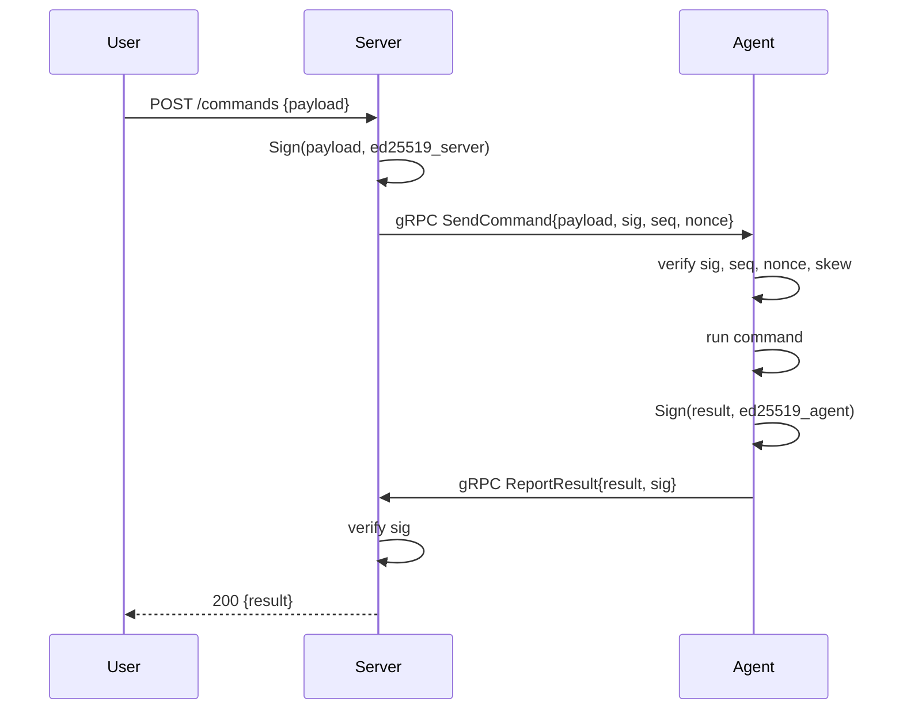

# Transport

The transport layer handles secure, authenticated, tamper-resistant communication between the hl_helper control plane and agents. It combines TLS 1.3 for confidentiality with Ed25519 signatures for authenticity, replay protection for integrity, and a streamlined enrollment protocol for zero-trust onboarding.

---

## Overview

Transport sits at the boundary between the FastAPI control plane and each Go agent, providing:

- **Confidentiality**: mTLS 1.3 with ciphersuite pinning (AES-256-GCM and ChaCha20-Poly1305 only).
- **Authentication**: Per-host short-lived certs (24h TTL) with SPIFFE-style URI SAN; server and agent signing keys (Ed25519) separate from TLS material.
- **Integrity**: Command + result envelopes signed with Ed25519; signatures verified before any action.
- **Replay protection**: Monotonic per-host sequence counter + per-command nonce LRU + clock-skew tolerance (60s default), persisted to SQLite.
- **Zero-trust enrollment**: One-time bootstrap token (base32, `hlb_` prefix) redeemed for a Certificate Signing Request (CSR); internal CA signs and returns the chain.

The protocol is **request-response on steroids**: server signs every command, agent verifies and returns a signed result. No command is executed without a valid signature; no result is processed by the server without a valid agent signature. The audit chain records all command/result pairs, linked by hash.

---

## mTLS 1.3: Per-Host Short-Lived Certs

Each enrolled agent receives a leaf certificate with:

- **Algorithm**: ECDSA P-256 (due to BoringSSL negotiation compatibility; Ed25519 in TLS is planned for future grpcio versions).
- **TTL**: 24 hours (auto-renewed at 50% TTL, approximately 12 hours after issuance).
- **Subject**: CN = `spiffe://fleet/host/<host_id>` (SPIFFE identity).
- **SAN**: `spiffe://fleet/host/<host_id>` as a URI SAN (not CN alone).
- **Issuer**: Internal intermediate CA (valid for 1 year).
- **TLS Cipher suite enforcement**: gRPC bridge enforces via `GRPC_SSL_CIPHER_SUITES=TLS_AES_256_GCM_SHA384:TLS_CHACHA20_POLY1305_SHA256` environment variable. If grpcio is built with BoringSSL (the default), only these ciphers negotiate; fallback to OpenSSL may allow weaker ciphers (tracked in threat model).

**Certificate Chain**: Leaf → Intermediate CA → Root CA (offline, never used after bootstrap). Root CA is backed up encrypted; it is not exposed to the running server.

**Renewal**: Agent initiates a CSR at 50% TTL. Server validates the signature on the CSR (using the agent's Ed25519 public key), signs a new leaf, and returns the chain via a `CertIssueResponse` gRPC message. The agent stores the new cert and key atomically.

---

## Signing Keys: Ed25519, Separate from TLS

Two Ed25519 key pairs are used, separate from TLS material:

### Server Signing Key
- **Purpose**: Sign every `CommandEnvelope` sent to agents.
- **Storage**: Encrypted on disk at `<data_dir>/signing/current.key` (PEM PKCS8, mode 0600).
- **Rotation**: Yearly (configurable). When rotated, the previous public key is retained in a grace window (7 days default) so in-flight commands signed with the old key still verify.
- **Trust Anchors**: All valid signing public keys (current + retired within grace) are published in a trust anchor list that agents query at startup.
- **Backup**: Can be extracted and stored offline; private key never transmitted.

### Agent Signing Key
- **Purpose**: Sign every `ResultEnvelope` returned to the server.
- **Storage**: Per-host, at `/var/lib/hl-agent/signing.key` (mode 0600, or TPM2-sealed).
- **Rotation**: Server-initiated. Agent receives a `Decommission` message with `requested_by` and `reason`, then generates a new key and sends a new CSR. Server validates signature on the new CSR with the agent's current public key before trusting the new one.
- **Per-host uniqueness**: Each agent has its own signing key. The server maintains a per-host public-key mapping and verifies results using the correct key.

Both keys use **raw 32-byte Ed25519 format** internally (also serializable as PEM for archival).

---

## Replay Protection: Monotonic Sequence + Nonce LRU + Clock Skew

Replay protection is enforced in layers:

### 1. Monotonic Sequence Per Host
Each `CommandEnvelope` carries a `sequence: uint64` field. The server increments this for every command sent to a host. The agent tracks `last_acked_seq` in its heartbeat. When the server sends a command with sequence *N*, the agent:
- Rejects if *N* ≤ `last_acked_seq`.
- Accepts and updates `last_acked_seq = N`.

The server-side `PersistentReplayStore` enforces monotonicity before processing results:
```python
if sequence <= last_sequence:
  raise SequenceRegressionError(...)
```

**Bootstrap**: First command to a host uses sequence 1. If the agent is restarted, it persists its last `acked_seq` in SQLite and can resume from there.

### 2. Per-Command Nonce LRU
Each `CommandEnvelope` also carries a `nonce: bytes` (random, typically 32 bytes). The server generates a fresh nonce for every command. The agent and server both track seen nonces in an LRU cache:

- **Server-side**: `PersistentReplayStore.seen_nonce` SQLite table; tracks (host_id, nonce, seen_at). Default window: 1024 nonces per host.
- **Agent-side**: In-memory LRU in the agent's command dispatcher (implementation in `agent/internal/transport/`).

If the same nonce appears twice, it is rejected as a duplicate. The nonce is valid only if it is strictly newer than the oldest nonce in the window.

### 3. Clock Skew Clamp
Commands carry `issued_at` and `expires_at` timestamps. The `PersistentReplayStore.accept()` method enforces:

```python
if issued_at > now + timedelta(seconds=skew_tolerance_s):
  raise ClockSkewError(...)
if expires_at <= now:
  raise ExpiredCommandError(...)
```

Default `skew_tolerance_s` is 60 seconds. Commands expire 5 minutes after issuance (configurable). This allows for up to 60 seconds of clock drift between server and agent without rejecting the command.

### 4. SQLite Persistence
The replay store uses WAL mode (`PRAGMA journal_mode=WAL`) and `PRAGMA synchronous=NORMAL` to balance durability and performance. Data is persisted to disk so that replayed commands are detected even across server restarts or agent network interruptions.

---

## Bootstrap-Token Enrollment

A one-time bootstrap token is generated by the admin and given to the installer script. The token redeems a Certificate Signing Request (CSR) and returns the agent's leaf certificate and CA chain.

### Token Format and Lifecycle

- **Format**: Base32-encoded 256-bit random value with `hlb_` prefix. Example: `hlb_abcd1234efgh5678ijkl9012mnop3456`.
- **Generation**: Issued via the admin API (coming in C2). Stored as a salted hash at rest.
- **TTL**: 15 minutes (configurable via `FLEET_ENROLL_TOKEN_TTL`).
- **Single-use**: `redeemed_at` flag persisted in the `HostTokens` table. Concurrent redeem attempts use `UPDATE ... WHERE redeemed_at IS NULL` with row-count check to prevent races.

### Enrollment Handshake

1. **Install script** downloads the token and server endpoint.
2. **Agent** (fresh install, no keys yet):
   - Generates a random Ed25519 keypair.
   - Generates a random ECDSA P-256 keypair (for TLS cert).
   - Constructs a CSR with CN = `spiffe://fleet/host/<generated-host-id>` and SAN = `spiffe://fleet/host/<generated-host-id>`.
   - POSTs to `POST /v1/enroll` with `{ "token": "...", "csr_pem": "...", "hostname": "...", "agent_pubkey": "..." }`.
3. **Server**:
   - Validates token (not expired, not redeemed, IP rate-limited to 5 burst, ~0.5/sec sustained).
   - Extracts host ID and agent public key from the request.
   - Validates CSR structure (basic checks).
   - Signs the CSR with the internal CA, issuing a leaf cert with 24h TTL.
   - Atomically marks token `redeemed_at = now` in a single transaction.
   - Returns `{ "host_id": "...", "cert_chain_pem": "...", "ca_chain_pem": "...", "grpc_endpoint": "..." }`.
4. **Agent**:
   - Stores the leaf cert, CA chain, and signing key at `/var/lib/hl-agent/`.
   - Stores config (server URL, endpoint, CA fingerprint) at `/var/lib/hl-agent/config.json` (mode 0600).
   - Starts the main service loop and opens a gRPC stream to the server.

**Failure modes**:
- Token expired → `410 Gone`, agent must obtain a new token.
- Token already redeemed → `410 Gone`, agent must obtain a new token (prevents side-car races).
- CSR invalid → `400 Bad Request`.
- Rate limit exceeded → `429 Too Many Requests`, retry after `Retry-After` header.

---

## Certificate Rotation

Certificates are renewed every 24 hours (configurable). The agent initiates rotation at 50% TTL (approximately 12 hours after issuance).

### Rotation Flow

1. **Agent** (at 50% TTL):
   - Generates a new ECDSA P-256 keypair.
   - Generates a new CSR with the same CN/SAN as before (host ID must stay stable).
   - Extracts the signature on the CSR using its current Ed25519 signing key (server validates ownership).
   - Sends a `CertRotateRequest` gRPC message: `{ "host_id": "...", "csr_pem": "...", "csr_signature": "..." }`.

2. **Server**:
   - Validates the CSR signature using the agent's current public key (from the host record).
   - Validates CSR structure (CN/SAN match host ID).
   - Issues a new leaf cert with 24h TTL and the same CA chain.
   - Returns `CertIssueResponse` with the new cert and `not_after` timestamp.

3. **Agent**:
   - Stores the new cert and key atomically (writes to temp file, then renames).
   - Tears down the old gRPC connection and reconnects using the new cert.
   - Old cert remains valid until expiration for any in-flight connections.

**Key Continuity**: Each agent's signing key is rotated separately (server-initiated) and is **not** rotated on TLS cert renewal. This decouples identity (signing key) from confidentiality (TLS cert).

---

## Sequence Diagram: Command Execution



---

## Command and Result Envelopes

### CommandEnvelope
```protobuf
message CommandEnvelope {
  string command_id = 1;
  string host_id = 2;
  uint64 sequence = 3;
  bytes nonce = 4;
  google.protobuf.Timestamp issued_at = 5;
  google.protobuf.Timestamp expires_at = 6;
  string issued_by = 7;
  RiskLevel risk = 8;
  CapabilityToken capability = 9;
  oneof payload { ... }
  bytes signature = 200;  // Ed25519 over canonical bytes
}
```

The signature is computed over a **canonical encoding** of the envelope (all fields except `signature`), serialized using protobuf deterministic encoding. The server signs and the agent verifies.

### ResultEnvelope
```protobuf
message ResultEnvelope {
  string command_id = 1;
  string host_id = 2;
  int32 exit_code = 3;
  string stdout = 4;
  string stderr = 5;
  google.protobuf.Timestamp completed_at = 6;
  bytes signature = 200;  // Ed25519 over canonical bytes
}
```

The agent signs the result envelope with its signing key; the server verifies using the per-host public key.

---

## Failure Modes and Recovery

| Failure | Detection | Recovery |
|---|---|---|
| **Clock skew exceeded** | `issued_at > now + 60s` | Reject command; alert admin if persistent (NTP issue). |
| **Replay (duplicate sequence)** | `sequence <= last_sequence` | Reject; log to audit. |
| **Replay (duplicate nonce)** | Nonce in LRU window | Reject; log to audit. |
| **Expired command** | `expires_at <= now` | Reject; command expired (5 min TTL). |
| **Invalid signature** | Verification fails | Reject; audit log, suspect tampering. |
| **Cert expired** | TLS handshake fails | Agent reconnects after renewal; server closes stream. |
| **Agent signing key lost** | Result signature fails | Admin must revoke host and re-enroll (new signing key generated). |
| **Network partition** | No heartbeat for N minutes | Server marks host offline; commands queued in outbox; agent retries on reconnect. |

---

## Optional SSH Fallback

For hosts where the Go agent cannot be deployed (e.g., embedded systems, locked-down appliances), SSH provides a fallback command channel:

- **Protocol**: SSH with key-based authentication (not password).
- **Server-side SSH CA**: Optional SSH certificate authority (separate from the TLS CA).
- **Security**: Commands and results still signed with Ed25519; SSH provides transport-only confidentiality.
- **Limitation**: No replay protection at the SSH layer (relies on application-level signing).
- **Use case**: Legacy hosts, out-of-band recovery, audit-only mode.

Implementation is deferred to C2; documented in `docs/developer/design/ssh-fallback.md` (coming later).

---

## References

- **C1 Design Spec**: `docs/superpowers/specs/2026-05-02-hlh-c1-transport-design.md` (detailed threat model, architecture decision log).
- **Enrollment API**: `docs/developer/api/enrollment.md` (full `/v1/enroll` reference, error codes).
- **Threat Model**: `docs/developer/secure-dev/threat-model.md` (T3 replay attacks, T6 MitM, T7 token reuse).
- **Replay Store Implementation**: `server/app/crypto/replay_store.py` (SQLite schema, logic).
- **Signing Backend**: `server/app/crypto/signing.py` (key rotation, trust anchors).
- **Agent Transport**: `agent/internal/transport/` (gRPC client, TLS setup, retry logic).
