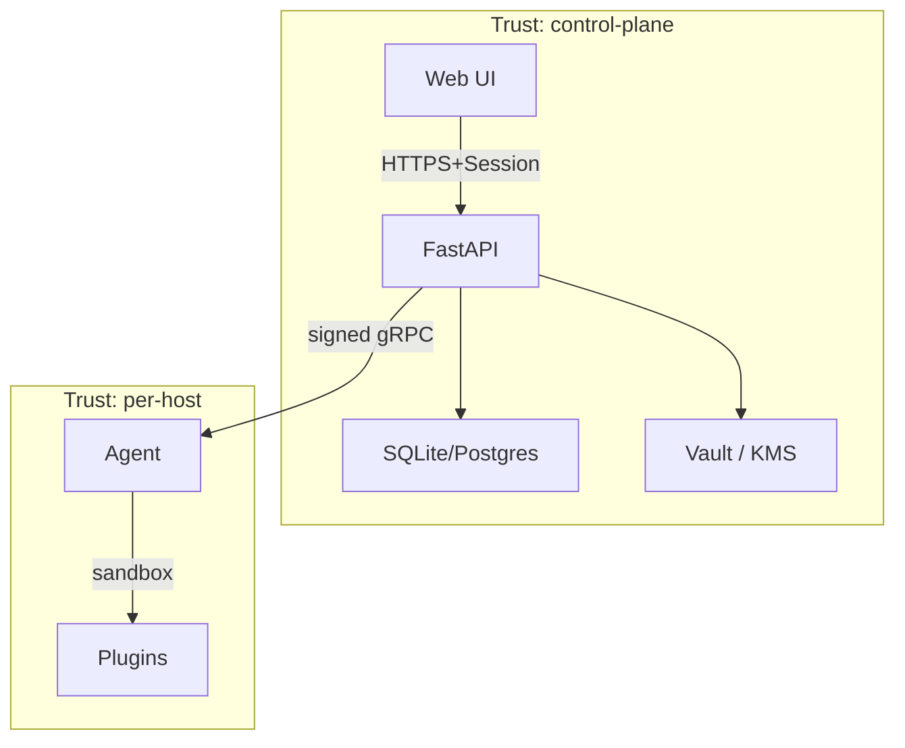

# Threat Model

This document describes the security assumptions, in-scope threats, mitigations, and known limitations of hl_helper.

## Trust Boundaries

hl_helper enforces four distinct trust boundaries:

### Server
The control plane (FastAPI + SQLite/Postgres) is the **source of truth** but does **not** have unilateral root access on hosts. It cannot mutate host state without an agent's consent.

### Agent
The Go agent is **outbound-only** and **read-only** on server state. It:
- Receives signed commands over mTLS gRPC
- Executes only commands within its capability manifest
- Returns signed results
- Cannot enumerate other hosts, impersonate other agents, or mutate server records
- Cannot escalate beyond its sudoers allowlist

### Plugin
Plugins are **isolated processes** with:
- Declared capabilities (biscuit tokens with scope + expiry)
- Brokered secrets (server returns handles, plugins never see plaintext)
- Proxied network egress (no direct internet)
- Signed manifests (cosign verification)

### UI
The web interface is **never trusted** for authorization decisions. All checks are server-side.

---

## In-Scope Threats

| # | Threat | Scope | Impact |
|---|---|---|---|
| **T1** | Compromised host (e.g., kernel exploit, malicious package) | Single host | Attacker controls agent but cannot pivot to server or other hosts |
| **T2** | Compromised plugin (e.g., typosquatting, supply-chain attack) | Single plugin | Attacker confined by plugin sandbox + brokered secrets; cannot access other plugins or host internals |
| **T3** | Replayed command (attacker captures legitimate command on network) | In-flight | Agent rejects out-of-order / duplicate sequence numbers + nonce LRU |
| **T4** | Forged command result (attacker intercepts result, modifies, re-sends) | Result validity | Server verifies per-host signing key; forged result detected + audit alert |
| **T5** | Audit log tampering (attacker with DB access modifies audit entries) | Audit integrity | Hash-chained log + signed Merkle checkpoints enable forensic verification |
| **T6** | Network MitM (attacker on router intercepts agent↔server gRPC) | Confidentiality + integrity | mTLS 1.3 with enforced ciphers (AES-256-GCM, ChaCha20-Poly1305) |
| **T7** | Stolen bootstrap token (admin leaves token in email, logs, etc.) | Enrollment | Token single-use + 15-min TTL; rate-limited per IP; no privilege escalation possible with token alone |
| **T8** | Weak admin password (admin chooses "password123") | Admin account | Argon2id hashing + zxcvbn complexity enforcement + brute-force lockout + optional HIBP check |
| **T9** | CRL cache miss (agent continues talking to revoked host) | Host access after revocation | Server publishes CRL at startup; revoked certs fail TLS handshake immediately; CRL refreshed on manifest update |
| **T10** | Compromised admin session token | Admin privilege | Sessions are revocable instantly; token stolen mid-session requires re-auth for high-risk verbs (via MFA step-up) |

---

## Out-of-Scope Threats

- **Physical access to server** — attacker with hands-on access can extract root CA key, sign arbitrary certs, modify database. Mitigated: back up root CA key offline (encrypted); restrict data-dir access.
- **Supply-chain attacks against dependencies** (grpcio, cryptography, etc.) — track upstream CVE lists; enforce SBOM scanning in CI.
- **Insider threat with valid admin credentials** — admin can see all secrets, read all audit, control all hosts. Mitigated: RBAC + approval gates + audit log visibility to other admins.
- **Server compromise (full code execution)** — attacker can steal root CA, command signing key, all secrets. Mitigated: integrate with Vault / HSM / Cloud KMS for key storage (v1.0+); keep signing key separate from TLS material.

---

## Mitigations

### Cryptographic primitives

| Threat | Mitigation | Mechanism |
|---|---|---|
| T3, T6 | Replay + network interception | mTLS 1.3 TLS_AES_256_GCM_SHA384 / TLS_CHACHA20_POLY1305_SHA256; monotonic sequence per host; per-command nonce |
| T1, T4 | Forged results from compromised host | Per-host Ed25519 signing key; server verifies before processing |
| T7 | Reuse of bootstrap token | Single-use flag + token_hash storage; atomic SQL consume-once transaction |
| T1 | Unauthorized command execution on agent | Biscuit capability token with scope + expiry; agent enforces before execution |
| T5 | Audit tampering | SHA-256 hash chain (prev_hash || actor || action || ...) + Ed25519 signatures on entries + signed Merkle checkpoints |

### Trust boundaries

| Threat | Mitigation | Mechanism |
|---|---|---|
| T1 | Compromise cannot pivot to server | Agent restricted to read-only RPCs (Heartbeat, SubmitResult, RequestCapability, RotateCert). No DeleteHost, ListHosts, WriteSettings allowed. Server-side RPC authz check. |
| T2 | Plugin cannot access secrets plaintext | Plugin receives SecretHandle; broker performs all uses (SMTP send, registry auth, etc.) internally. Reveal() requires admin re-auth. |
| T1 | Plugin sandboxing | bwrap default; rootless-podman recommended; OCI artifact runtime |
| T10 | Admin session revocation | Sessions revoked instantly on logout, role-change, password-reset, or admin force-logout. No grace period. |

### Enrollment & rotation

| Threat | Mitigation | Mechanism |
|---|---|---|
| T7 | Bootstrap token abuse | 15-min TTL, base32 format (hlb_<256 bits entropy>), hashed at rest, rate-limited per IP (5 burst, ~0.5/s), single-use flag persisted atomically |
| T1 | Weak agent key storage | Agent signing key stored at `/var/lib/hl-agent/signing.key` (mode 0600) or TPM2-sealed; TLS key (mode 0600); root-owned binary; systemd hardening |
| T6, T1 | Certificate rotation & validity | Leaf certs 24h TTL, auto-renewed at 50%; server signing key rotated yearly with 7d grace; intermediate CA 1y; old anchors retained for verification |

### Privilege enforcement

| Threat | Mitigation | Mechanism |
|---|---|---|
| T1 | Agent escalation beyond sudoers | sudoers allowlist with NOPASSWD per-distro; path-pinned binaries; validated with visudo -c; manifests also enforce per-command scope |
| T1 | Agent runs as unprivileged user | hl-agent runs as hl-agent:hl-agent system user, not root; systemd unit has NoNewPrivileges=yes + ProtectSystem=strict |
| T1 | Information leakage to unprivileged user | `/var/lib/hl-agent/` is mode 0700 hl-agent:hl-agent; `/etc/sudoers.d/hl-agent` is mode 0440; certs + keys never logged |

---

## Known Limitations

### TLS 1.3 cipher pin
- **Limitation**: AES-256-GCM + ChaCha20-Poly1305 enforcement enforced via `GRPC_SSL_CIPHER_SUITES` env var, which relies on grpcio ≥1.50 and BoringSSL build.
- **Mitigation**: CI verifies cipher negotiation in integration tests. If grpcio uses OpenSSL instead of BoringSSL, fallback ciphers may be weaker.
- **Tracking**: Pin grpcio version in pyproject.toml; test against multiple grpcio releases.

### Rate limiter (single-process)
- **Limitation**: In-memory rate limiter for `/v1/enroll` is per-process only. Multi-replica deployments need a shared store (Redis).
- **Mitigation**: v1.0 is single-server; C3 (auth spec) documents Redis backend for HA. Current scope: document in deployment guide.

### CRL hydration timing
- **Limitation**: CRL loaded from DB at startup. New revocations appear in agent's next stream only after manifest update OR next reconnection (within backoff timeout, default 30min max).
- **Mitigation**: Admin can force reconnect via `hl-agent rotate-signing-key` on CLI; UI includes "Force reconnect" on host page. Revocations are effective immediately on server (streams closed, new handshakes fail).

### Admin authentication (static bearer token in v1.0)
- **Limitation**: Bootstrap admin token is checked at first login only. Full RBAC with per-admin credentials is **planned in C3**.
- **Mitigation**: v1.0 assumes single-admin or trusted team sharing credentials. Change `FLEET_ADMIN_TOKEN` env var and restart server to rotate. C3 will introduce local accounts + OIDC + MFA.

### TPM2 in containers
- **Limitation**: If agent runs in a container with shared `/dev/tpmrm0`, multiple containers can access the same TPM. Attacker in sibling container can access agent's sealed key.
- **Mitigation**: Documented; admin must opt-in with `FLEET_USE_TPM=1`. Typical homelab deployments run one agent per host. Flag in docs: "Do not share TPM between containers on untrusted hosts."

### Ed25519 in TLS 1.3 (BoringSSL limitation)
- **Decision (locked)**: Per-host TLS certs use **ECDSA P-256** (not Ed25519) because BoringSSL in grpcio does not negotiate Ed25519 signature_algs reliably across versions. Command signing still uses Ed25519 (verified by application code, not TLS handshake). This is not a security issue (ECDSA P-256 is secure) but a usability workaround.
- **Tracking**: Monitor grpcio + BoringSSL version compatibility. If future versions support Ed25519 in TLS 1.3, upgrade plan exists.

---

## Component Diagram

## RBAC Matrix

Full RBAC details are documented in `docs/developer/design/rbac.md`. Summary of role permissions:

| Permission | Viewer | Operator | Admin | Owner |
|---|---|---|---|---|
| **host:read** | ✓ | ✓ | ✓ | ✓ |
| **host:exec** | | ✓ | ✓ | ✓ |
| **host:revoke** | | | ✓ | ✓ |
| **secret:read** | | | ✓ | ✓ |
| **secret:write** | | | ✓ | ✓ |
| **user:write** | | | ✓ | ✓ |
| **role:write** | | | ✓ | ✓ |
| **user:impersonate** | | | | ✓ |
| **audit:read** | | ✓ | ✓ | ✓ |

High-risk permissions (host:exec, secret:write, user:impersonate, etc.) require MFA step-up and optional approval gates. See `docs/developer/design/rbac.md` for the complete matrix and Cedar policy extension.

---

## Verification

hl_helper's threat model is tested continuously:

- **Unit tests** — signature verification, replay rejection, capability denial, hash-chain detection.
- **Integration tests** — full enrollment + command roundtrip on Debian, Ubuntu, Rocky, Fedora, Arch, Alpine.
- **Negative tests** — tampered commands rejected, bootstrap token reuse blocked, CRL revocation immediate, audit tampering detected.
- **E2E tests** — Docker compose multi-host setup, attacker scenarios (network MitM, result forgery, outbox tamper), verification CLI tools.
- **Load tests** — 1000 simulated agents, p99 command latency <2s, audit chain verified continuously.

See `tests/e2e/test_threat_model.py` for the test suite.

---

## References

- **Threat model by component**: `docs/superpowers/specs/2026-05-02-hlh-c1-transport-design.md` (C1 spec)
- **Detailed cryptography**: `docs/security/key-management.md`
- **Agent privilege model**: `docs/security/agent-privilege-model.md`
- **Enrollment security**: `docs/security/enrollment.md`
- **Incident response**: `docs/security/recovery.md`
